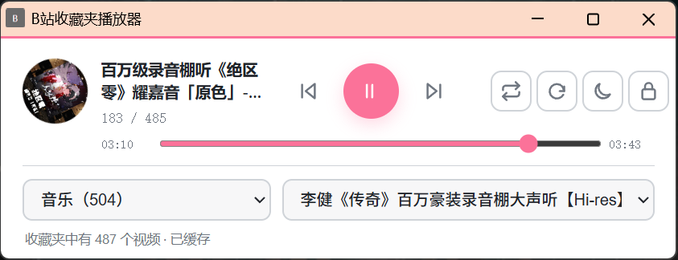
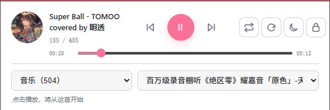

# B站收藏夹播放器

把 B 站收藏夹变成一个轻量的后台音乐播放器。

## 界面预览

### 独立播放器窗口



### 工具栏弹窗



## 功能

- 选择自己的 B 站收藏夹
- 从指定视频开始播放
- 列表循环和随机播放
- 播放、暂停、上一首、下一首和进度跳转
- 视频结束后自动切换
- 日间与夜间模式
- 可拖动的独立播放器窗口
- 收藏夹缓存、自动过期刷新和手动刷新
- 复用一个后台 B 站标签页，不直接解析或下载音视频

## 安装

### Chrome

1. 下载并解压项目。
2. 打开 `chrome://extensions`。
3. 开启右上角的「开发者模式」。
4. 点击「加载已解压的扩展程序」。
5. 选择包含 `manifest.json` 的项目目录。

### Edge

步骤相同，扩展管理页面地址为 `edge://extensions`。

## 使用

1. 在同一个浏览器中登录 B 站。
2. 点击工具栏里的扩展图标。
3. 选择收藏夹和视频，然后点击播放。
4. 点击锁形按钮，可以打开不会自动关闭的独立播放器窗口。
5. 点击刷新按钮，可以立即重新读取收藏夹。

收藏夹会缓存 15 分钟，以减少大量分页请求。B 站临时拒绝请求时，扩展会继续使用上次成功加载的缓存。

## 自动播放限制

Chrome 或 Edge 可能拦截第一次带声音的自动播放。遇到提示时，在扩展创建的 B 站标签页中手动播放一次。之后通常可以继续在后台自动切歌。

## 隐私

- 扩展不保存账号、密码或 Cookie。
- 登录状态由浏览器和 B 站网页管理。
- 收藏夹标题、视频标题、封面和播放状态只保存在浏览器扩展的本地存储中。
- 扩展不会上传用户数据，也不包含统计或跟踪代码。

## 项目结构

```text
manifest.json  扩展清单和权限
popup.html     播放器界面
popup.js       收藏夹读取、缓存和界面交互
worker.js      播放队列、标签页和状态管理
content.js     B 站视频元素控制与进度同步
```

## 开发检查

项目没有构建步骤和第三方依赖。修改后可以运行：

```powershell
node --check popup.js
node --check worker.js
node --check content.js
Get-Content -Raw manifest.json | ConvertFrom-Json
```

然后在扩展管理页面点击「重新加载」。

## 已知限制

- 独立窗口可以拖动，但浏览器扩展 API 不能保证它始终置顶。
- 首次自动播放是否放行由浏览器决定。
- 收藏夹读取依赖 B 站网页接口，频繁刷新可能触发临时限制。
